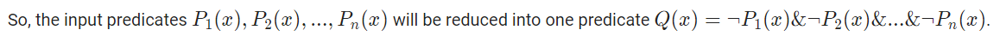

###Understanding lambda expressions
By lambda expression we mean an anonymous function that allows to use code as data and pass it as an argument to a method.
In previous versions of java many developers used anonymous classes for these purposes. But this solution had some problems: a code was unclear and had redundancy.

Let's see an example.
```
Callable<Integer> callable = new Callable<Integer>() { 
@Override
public Integer call() throws Exception {
return 10;
}};
```


If we use Java 8+ we can rewrite this code more simple and clear with the lambda:

Callable<Integer> callable = () -> 10;
The Callable<V> interface is often used in multithreading programming with lambdas, but in this 
example it is not important. The main thing is it may be instanced with a lambda expression 
because the interface has only one non-static and non-default method.

###Writing lambda expressions
A lambda expression has two parts: the part before the arrow operator "->" are the parameters 
and the part following the "->" is its body.

There are a lot of ways to write lambda expressions in Java 8. Let's consider some examples.
```
// a simple way to write a lambda expression
BiFunction<Integer, Integer, Integer> sum = (x, y) -> x + y;

// if the only one argument
Function<Integer, Integer> identity = x -> x; // (x) -> x; is valid too

// without type inference
Function<Integer, Integer> mult = (Integer x) -> x * 2;

// with multiple statements
Function<Integer, Integer> adder = (x) -> {
x += 5;
x += 10;
return x;
};
```

The code before operator "=" is not important now, but you should know Function<T, R> 
is an interface for representing functions.

Additional explanations:

**BiFunction<T, U, R>** is an interface representing function with two arguments of types T and U. 
It returns value of type R.
**Function<T, R>** is also a special interface but it has only one argument of type T 
and returns value of type R.

**Functional interface** is an interface with a single abstract method (SAM type). Static and default methods are allowed here. Any functional interface can be implemented using lambda expressions, methods references or anonymous classes.

Examples: Runnable, Callable<V>, Comparator<T>, ActionListener and others.

IMPORTANT: you can't extend class (even abstract), enum or annotation by a lambda expression or a method reference.

There is a special annotation @FunctionalInterface exists in The Java Class Library. It marks functional interfaces and indicates if the interface doesn't satisfy the requirements of a functional interface. The annotation is not mandatory for creating lambda expressions but it's recommended to mark functional interfaces.

Let's declare our own generic functional interface for representing a simple function with one argument. See code below.

```@FunctionalInterface
public interface Fun<T, R> {
R apply(T t);

    static void doNothingStatic() { }
    default void doNothingByDefault() { }
}
```

Now we can create an instance of Fun<Double, Double> using lambda expression.

```
Fun<Double, Double> fun = (x) -> x * 2 + 1;
```
It means the fun accepts Double value  x and returns other double value (x * 2 + 1).

To get result we call the apply method of the functional interface. It's just like an object.
```
double result = fun.apply(3d);
```

Since java 8 the JCL has a lot of functional interfaces that represent functions. These functional interfaces are in java.util.function.
The package contains more than 40 functional interfaces of five groups: functions, operators, predicates, suppliers and consumers.

Let's consider these groups.
**Functions** accept arguments and produce results.
**Operators** produce results of the same type as their arguments (special case of function).
**Predicates** return boolean values and accept any arguments (boolean-valued function).
**Suppliers** return values and accept nothing.
**Consumers** accept arguments and return no result.
Main differences between functional interfaces in the same group are number of arguments and generic or not.

Some examples:
**Function<T, R>** accepts a value of type T and produces a result of type R.
**BiFunction<T, U, R>** accepts two values of T and U types and produces a result of type R.
**LongFunction<R>** accepts a long value and produces a result of type R.
**IntToDoubleFunction** accepts an integer value and produces a double value.
**IntPredicate** accepts an integer value and returns boolean value.
**Supplier<T>** returns a value of type T.
**BiConsumer<T, U>** accepts two values of T and U types.
And others...

For details see https://docs.oracle.com/javase/8/docs/api/java/util/function/package-summary.html

Sometimes we will use generic interfaces and sometimes non-generic.

Examples
Let's consider some functional interfaces.

```
// generator accepts nothing and returns integer value 3
IntSupplier generator = () -> 3;

final int factor = 2;

// multiplier accepts an integer value and returns another one, it uses closure
IntUnaryOperator multiplier = val -> factor * val;

// predicate isEven accepts an integer value and returns true if the value is even else false
IntPredicate isEven = val -> val % 2 == 0;

// printer accepts a value and prints it in the standard out, it returns nothing
Consumer<String> printer = System.out::println;
```

As you can see, types of interfaces (left) and type of lambdas (right) has the same semantic meaning. Actually, parameters and returned value of lambda corresponds to parameters and returned value of the SAM in a functional interface.

IntSupplier has a method int getAsInt() that corresponds to lambda () -> 3 in the example above.
Also, IntPredicate has a method boolean test(int value) that corresponds to lambda val -> val % 2 == 0.
Function composition is a powerful mechanism for combining functions to build more complicated functions.

COMPOSING FUNCTIONS

In java 8, the functional interface Function<T, R> has two default methods compose(...) and andThen(...) for composing new functions. The main difference between these methods is the execution order.

**Generally, f.compose(g).apply(x) is the same as f(g(x)), and f.andThen(g).apply(x) is the same as g(f(x)).**

Let's see an example with two functions: adder and multiplier.
```
Function<Integer, Integer> adder = x -> x + 10;
Function<Integer, Integer> multiplier = x -> x * 5;

// compose: adder(multiplier(5))
System.out.println("result: " + adder.compose(multiplier).apply(5));

// andThen: multiplier(adder(5))
System.out.println("result: " + adder.andThen(multiplier).apply(5));
```

In this case method compose returns a composed function that first applies multiplier to its input, and then applies adder to the result. Method andThen returns a composed function that first applies adder to its input, and then applies multiplier to the result.
```
The result of this program:
result: 35
result: 75
```
COMPOSING PREDICATES

The functional interface IntPredicate (as well as other predicates) has three methods for composing new predicates: and(...), or(...) and negate(...). The meaning is clear from the names.

Let's assume we have List<Integer> numbers filled by integer numbers from 1 to 30 (inclusive).
We'd like to print only those numbers which are odd or can be divided by 3 (i.e. x % 3 == 0).

The code to do it is shown below.
```
IntPredicate isEven = x -> x % 2 == 0;
IntPredicate dividedBy3 = x -> x % 3 == 0;
IntPredicate pred = isEven.negate().or(dividedBy3);

// print all odd values and even values that can be divided by 3.
numbers.forEach(val -> {
if (pred.test(val)) System.out.print(val + " ");
});
```
The result of this program:
```
1 3 5 6 7 9 11 12 13 15 17 18 19 21 23 24 25 27 29 30
```
By this, we finish our consideration of functional interfaces and java.util.function.


Let's consider these groups.
- **Functions** accept arguments and produce results.
- **Operators** produce results of the same type as their arguments (special case of function).
- **Predicates** return boolean values and accept any arguments (boolean-valued function).
- **Suppliers** return values and accept nothing.
- **Consumers** accept arguments and return no result.
Main differences between functional interfaces in the same group are number of arguments and generic or not.

Some examples:
- **Function<T, R>** accepts a value of type T and produces a result of type R.
- **BiFunction<T, U, R>** accepts two values of T and U types and produces a result of type R.
- **LongFunction<R>** accepts a long value and produces a result of type R.
- **IntToDoubleFunction** accepts an integer value and produces a double value.
- **IntPredicate** accepts an integer value and returns boolean value.
- **Supplier<T>** returns a value of type T.
- **BiConsumer<T, U>** accepts two values of T and U types.
And others...
  Let's consider some functional interfaces.

```// generator accepts nothing and returns integer value 3
IntSupplier generator = () -> 3;

final int factor = 2;

// multiplier accepts an integer value and returns another one, it uses closure
IntUnaryOperator multiplier = val -> factor * val;

// predicate isEven accepts an integer value and returns true if the value is even else false
IntPredicate isEven = val -> val % 2 == 0;

// printer accepts a value and prints it in the standard out, it returns nothing
Consumer<String> printer = System.out::println;
```

As you can see, types of interfaces (left) and type of lambdas (right) has the same semantic meaning. Actually, parameters and returned value of lambda corresponds to parameters and returned value of the SAM in a functional interface.

IntSupplier has a method int getAsInt() that corresponds to lambda () -> 3 in the example above.
Also, IntPredicate has a method boolean test(int value) that corresponds to lambda val -> val % 2 == 0.

###**Functional programming**
####**and object-oriented design patterns**

In object-oriented design various patterns are widely used, such as factory, strategy, template method, command, chain of responsibility, observer and so on.

In some of these patterns we need to create a base class (abstract or interface) with single abstract method and then implement it in all concrete classes (for example, in strategy, chain of responsibility, observer and some others) or do something similar. In this case we can use lambda expressions instead of creating concrete classes.

Let's see an example: rewriting strategy pattern using lambda expressions.
If you are not already familiar with the pattern, read this: https://en.wikipedia.org/wiki/Strategy_pattern.

Our domain is generating an account number using different algorithms. We have four classes as show below.

```/**
* Generates an account number using a generation strategy
  */
  class NumberGenerator {

  // This may be any subclass of GenerationStrategy
  private final GenerationStrategy strategy;

  public NumberGenerator(GenerationStrategy strategy) {
  this.strategy = strategy;
  }

  public String generate() {
  return strategy.generate();
  }

  public GenerationStrategy getStrategy() {
  return strategy;
  }
  }

/**
* Abstract generation strategy
  */
  abstract class GenerationStrategy {

  abstract String generate();
  }

/**
* Concrete generation strategy. It generates number based on UUID
  */
  class UUIDGenerationStrategy extends GenerationStrategy {

  @Override
  public String generate() {
  return UUID.randomUUID().toString();
  }
  }

/**
* Concrete generation strategy. It generates number based on the prefix and a random value
  */
  class FormattedRandomGenerationStrategy extends GenerationStrategy {
  private final Random random = new Random();

  @Override
  public String generate() {
  return "111-123-" + Math.abs(random.nextInt());
  }
  }
```
There are NumberGenerator, an abstract GenerationStrategy and two concrete strategies: UUIDGenerationStrategy and FormattedRandomGenerationStrategy that represents concrete algorithms.

Now, we can use it as follows.

```// an example of using UUIDGeneratingStrategy
final NumberGenerator uuidGenerator = new NumberGenerator(new UUIDGeneratingStrategy());

System.out.println(uuidGenerator.generate());

// an example of using FormattedRandomGenerationStrategy
final NumberGenerator randomGenerator = new NumberGenerator(new FormattedRandomGenerationStrategy());

System.out.println(randomGenerator.generate());
```

If we'd like to create new generation strategy (new behavior), we need to write a new concrete strategy class.

Instead of this, we can use lambda expressions to create new strategies easy and concise. We don't need to modify NumberGenerator class, but let's rewrite our abstract GenerationStrategy as follows and remove our classes for representing concrete strategies.


```/**
* Functional interface for the abstract generation strategy.
* It's a String supplier
  */
  @FunctionalInterface
  interface GenerationStrategy {

  String generate();

}
```
Now, we can use the strategy pattern as follows.


```
// It's instead of UUIDGeneratingStrategy
final NumberGenerator uuidGenerator = new NumberGenerator(() -> UUID.randomUUID().toString());

System.out.println(uuidGenerator.generate());

final Random random = new Random();
// Another simple generator for tests purposes
final NumberGenerator testGenerator = new NumberGenerator(() -> "test-" + String.valueOf(random.nextInt(100)));

System.out.println(testGenerator.generate());
```


You can find more information about writing design patterns in functional style this:
Richard Warburton. Java 8 Lambdas
Raoul-Gabriel Urma, Mario Fusco, and Alan Mycroft. Java 8 in Action


###Understanding streams
Stream is a tool for data sequences processing in a more functional style. We don't need to use loops because a stream has an internal optimized cycle. Streams allow you to concentrate on the question "what should the code do?" instead of "how should the code do it?". In addition, this approach is easy for parallelizing.

A stream may seem like a collection. But, actually, a stream doesn't store elements. It conveys elements from a source such as a collection, an array, a generator function, an I/O channel, another stream and so on.

There are several stream classes in Java: Stream<T>, IntStream, LongStream and DoubleStream. While generic stream works with reference types, three other streams work with corresponding primitive types. Further we will consider what and when is better to use.

Let's see an example. It is often necessary to filter a list by a condition and then collect suitable elements in a new list.
```
// the list values is filled with some elements
List<Integer> values = ...
List<Integer> filteredValues = new ArrayList<>();
for (Integer val : values) {
if (val >= 10) {
filteredValues.add(val);
}
}
```
The cycle with a filtering is an often used construction in data processing. The same functionality with Stream API is shown below.
```
// the list values is filled with some elements
List<Integer> values = ...
List<Integer> filteredValues = values.stream()
.filter(val -> val >= 10)
.collect(Collectors.toList());
```

In this case, we get a stream from a collection, then filter elements by a condition and collect the stream to a new List collection. It's simple enough. The method filter accepts a predicate (in this case, represented by lambda expression) to test each value in the stream.

IMPORTANT: when we apply method filter to a stream, nothing is evaluated. Only terminal operations begin evaluations (for example, collect). Because of it, streams are called lazy.

Further we will consider ways to create streams and some common stream operations.

###How can I create a stream?
There are a lot of ways to create a stream in Java.

1) The most common way to take a stream is to create it from a collection. Any collection has a method stream() for this purpose.
```
List<Integer> famousNumbers = Arrays.asList(0, 1, 1, 2, 3, 5, 8, 13, 21, 34, 55);
Stream<Integer> numbersStream = famousNumbers.stream();
Set<String> usefulConcepts = new HashSet<>(Arrays.asList("functions", "lazy", "immutability"));
Stream<String> conceptsStream = usefulConcepts.stream();
```
2) From an array

```
Stream<Double> doubleStream = Arrays.stream(new Double[]{ 1.01, 1d, 0.99, 1.02, 1d, 0.99 });
```
4) From a string

```
IntStream stream = "aibohphobia".chars(); // It returns IntStream!
```

4) From values
```
LongStream longStream = LongStream.of(111_111_111L, 333_333_333L);

```
5) From another streams
```
Stream<BigInteger> concatedStream = Stream.concat(Stream.empty(), Stream.empty());
```
6) Use Stream.generate()
```
Stream<User> userStream = Stream.generate(User::new);
DoubleStream randomStream = DoubleStream.generate(Math::random);
```
7) Use Stream.iterate()
```
IntStream oddNumbersStream = IntStream.iterate(1, x -> x + 2);
```
8) Use Stream.range() or Stream.rangeClosed(). Method rangeClosed() includes an upper bound.
 ``` 
LongStream rangedStream = LongStream.rangeClosed(100_000, 1_000_000);
```
There are also other ways to create a stream: from a file, from I/O stream and so on.

##Common stream operations
All stream operations are divided into two groups:

- **Intermediate operations** that are always lazy and returns a new stream, such as **filter**, **map**, **limit**, **sorted**, ...
- **Terminal operations** that returns a result or produce a side-effect, such as **min**, **max**, **count**, **reduce**, **collect**, ...
Let's consider some common used operations.

**Intermediate operations**
- **filter** returns a stream including the elements that match a predicate
map returns a stream consisting of the elements that was obtained by applying a function (transforms each element)
- **limit** return a stream consisting of first N elements of this stream
- **distinct** returns a stream that have only unique elements according to method **equals**
- **sorted** returns a stream consisting of the elements, sorted according to natural order / the given comparator
- **flatMap** allows to replace a value with a stream and concatenates all streams together

**Terminal operations**
- **collect(toList)** returns a list from the values in a stream, in general cases collect is a more complex operation
- **toArray** returns an array from the values in a stream
- **max / min** returns maximum / minimum element of the stream according to the given comparator
- **count** returns the count of elements in the stream
- **forEach** performs an operation for each elements of the stream (be careful with side-effects!)
- **reduce** combines values from the stream into a single value (aggregate value)
- **anyMatch** returns true if at least one element matches a predicate (see also: allMatch, noneMatch)

Such operations as **filter, map, flatMap, reduce, forEach** and some others are called **higher-order functions** because they accept another functions as arguments.

For more details, see:
https://docs.oracle.com/javase/8/docs/api/java/util/stream/Stream.html
https://www.tutorialspoint.com/java8/java8_streams.htm
the book with pictures Richard Warburton. Java 8 Lambdas

**Example 1.** Let's assume we have a list of words and we'd like to construct a long word from the short words (length < 4). The long word should be in upper case, each source word must be in the result only once.

```
String longWord = words.stream()
.filter(w -> w.length() < 4)
.map(String::toUpperCase)
.distinct()
.reduce("", String::concat); // terminal operation
```

1) creating a stream from the list (**stream()**)
2) filtering the stream by lengths of the words (**filter()**)
3) mapping each word to upper case (**map()**)
4) removing the repeating words (**distinct()**)
5) concatenating all words (**reduce()**), the first argument is identity (neutral element), the second is a function for combining result.

A list of words and the corresponding long word:

```
The word list: [picture, Day, act, hit, bag, CAT, word, cat, we, act, WELL, switch, eye]
The result long word: DAYACTHITBAGCATWEEYE
```

Think about why we can't to swap map and distinct operations in this example.

**Example 2**. Let's see another example. We'd like to check the value 10 is presented in the given range [1, 10) or not.

```
boolean hasValue10 = IntStream.range(1, 10).anyMatch(x -> x == 10);
```

1) creating an integer stream (a special type of stream) with values in range [1, 10), i.e. 10 is excluded
2) check the value 10 is presented in the stream
   Of course, hasValue10 == false.

As you see, Stream API makes data processing easier and our code more clear.

###Stream classes
```Stream<T>``` represents a sequence of elements of type **T**, but there are several other classes for streams: IntStream, LongStream and DoubleStream. They are primitive specialization of Stream<T>.

These streams have some features:

- Their methods accept primitive-specialized functions. For example, **IntStream.filter()** accept **IntPredicate**, but not **Predicate<Integer>**.
- They have additional methods. For example, all of these stream have methods average() and summaryStatistics(). IntStream and LongStream have two considered methods range() and rangeClosed().
- Using of primitive specialized functions and streams have the performance benefits because it allows to avoid boxing and unboxing operations and not only.

Finally, we'd like to calculate number of elements, max, min and average value in a stream. Let's use IntStream to do it!

IntSummaryStatistics stat = IntStream.rangeClosed(1, 55_555).summaryStatistics();
```
System.out.println("Count: " + stat.getCount());
System.out.println("Max: " + stat.getMax());
System.out.println("Min: " + stat.getMin());
System.out.println("Avg: " + stat.getAverage());```
```

The result is shown below. You can't do the same with Stream<Integer>.
```
Count: 55555
Max: 55555
Min: 1
Avg: 27778.0
```

It should be noted:
to transform a stream of primitives into generalized stream there is boxed method **(IntStream => Stream<Integer>)**
to transform a generalized stream into a stream of primitives there are special types of map function: **mapToInt, mapToLong, mapToDouble.**
Pay attention there is no CharStream in Java.

##Main topics:

```
map;
flatMap;
reduce;
mapping and reducing with functions;
forEach
```
##map
The **map** operation transforms some elements into others (N to N transformation, no more, no less).

Actually, map is often used to get a properties from stream of objects.

For example, we have a list of job offers, each job has a title, description, salary and so on. We can create a list that includes all job titles:
```
List<String> titleList = jobList.stream().map(Job::getTitle).collect(Collectors.toList());
```
Another common use is to create **DTO** (it's not always good) for passing an object between modules or returning response from a service.

Let's assume we have an account (id, number, sum, isLocked, created, lastUpdated, owner, ...) and user that is owner (id, firstName, lastName, phone, ...). We'd like to return a list of accounts through a service without unnecessary data. Then we do:
```
List<AccountInfo> infoList = accounts.stream()
.map(a -> {
AccountInfo info = new AccountInfo();
info.setNumber(a.getNumber());
info.setActive(!a.isLocked());
info.setSum(a.getSum());
String wholeName = a.getOwner().getFirstName() + a.getOwner().getLastName();
info.setOwnerFullName(wholeName);
return info;
}).collect(Collectors.toList());
```
3) Sometimes map is used with **identity function** that applies x and returns x. You can use the lambda **x -> x** or **Function.identity()** for these purposes.

##flatMap
The flatMap operation is used to transform each element from a stream into another stream and concatenates all streams into one. For instance, to obtain elements of an internal collection in a class.

Let's imagine there is a collection of java books exists. Each book has a title, a year of publishing and a list of authors (only names). It is necessary to obtain a collection of all authors from the list of java books.

```
// the collection of java books
final List<Book> javaBooks = Stream.of(
new Book("Java EE 7 Essentials", 2013, Arrays.asList("Arun Gupta")),
new Book("Algorithms", 2011, Arrays.asList("Robert Sedgewick", "Kevin Wayne")),
new Book("Clean code", 2014, Arrays.asList("Robert Martin"))
).collect(Collectors.toList());

// list of authors
final List<String> authors = javaBooks.stream()
.flatMap(book -> book.getAuthors().stream()) // many strams!!!
.distinct()
.collect(Collectors.toList());
```

The content of authors list:
[Arun Gupta, Robert Sedgewick, Kevin Wayne, Robert Martin]


##reduce
The **reduce** operation combines elements into a single value. But how does it work?

Let's assume we have a list of numbers 1, 2, ..., 7. Let's summarize the numbers using reduce:
```
int sum = numbers.stream().reduce(0, (acc, elem) -> acc + elem);
```
The first argument of reduce is a neutral element 0 (0 + elem = elem), the second argument is a sum function. The sum function accepts two parameters: acc is an accumulated value and elem is a next element in the stream.

These are our calculations: (((((((0 + 1) + 2) + 3) + 4) + 5) + 6) + 7).

We can see it if just add println into the lambda:
```
(acc, elem) -> {
System.out.println("acc = " + acc + ", " + "elem = " + elem);
return acc + elem;
}
```
Output:
```
acc = 0, elem = 1
acc = 1, elem = 2
acc = 3, elem = 3
acc = 6, elem = 4
acc = 10, elem = 5
acc = 15, elem = 6
acc = 21, elem = 7
```
After computing 21 + 7 = 28.
Accumulating is one of main principles of a reduction.

##Mapping and reducing with functions
As functions are presented as objects we can map and reduce them like values.

For example, we have a collection of integer predicates. Let's negate each predicate using a map operator and then conjunct all predicates into one using a reduce operator.
```
public static IntPredicate negateEachAndConjunctAll(Collection<IntPredicate> predicates) {
return predicates.stream()
.map(IntPredicate::negate)
.reduce(n -> true, IntPredicate::and);
}
```
In this example, map negates each predicate in a stream and then reduce conjuncts all predicates into one. The initial value (seed) of reducing is a predicate that is always true, because it's the neutral value for a conjunction.



##forEach
Stream API has some operations with side-effects such as forEach.

For example, we have a list of accounts. Each account has a number, sum and isLocked flag (true, false). We'd like to block all accounts which have too much money (> 10 000 000 abstract units). And it's pretty simple:
```
accountList.stream()
.filter(a -> a.getSum() > 10_000_000)
.forEach(a -> a.setLocked(true));
```
Before blocking:
```
[
Account{number='72300001', sum=888888777555, isLocked=false},
Account{number='72300002', sum=222222222222, isLocked=false},
Account{number='72300002', sum=7000000, isLocked=false}
]
```
After blocking:
```
[
Account{number='72300001', sum=888888777555, isLocked=true},
Account{number='72300002', sum=222222222222, isLocked=true},
Account{number='72300002', sum=7000000, isLocked=false}
]
```
Also, **forEach** may be used for logging each element from a collection or during testing with assert statements inside a lambda.

##**Main topics:**

###producing collections;
###partitioning and grouping;
###producing values;
###downstream collectors.

##Producing collections
Any stream has a method collect() that allows to produce collections (Lists, Sets, Maps and others).

Let's assume, we have a list of accounts. Each account has a balance (Long), an unique number (String) and some other fields.

In this case we can:

- accumulate numbers into a List<String>
```
List<String> numberList = accounts.stream()
.map(Account::getNumber)
.collect(Collectors.toList());
```
- or into a Set<String>
```
Set<String> numberSet = accounts.stream()
.map(Account::getNumber)
.collect(Collectors.toSet());
```

or even collect numbers and balances into a Map<String, Long>:
```
Map<String, Long> numberToBalanceMap = accounts.stream()
.collect(Collectors.toMap(Account::getNumber, Account::getBalance));
```
When you try to collect elements into a List<T> or a Set<T>, the concrete implementation of the collection is chosen by the stream framework. It's possible to choose a concrete collection manually:

```
stream().collect(Collectors.toCollection(HashSet::new));
```
Sometimes we need to collect elements into a thread-safe collection like a ConcurrentMap. We can do it.

##Partitioning and grouping
Partitioning is an operation that splits your data by a predicate into map of two collections. The key of the map has a type Boolean.
For example we will split all accounts into two lists by a predicate: balance >= 10000:
```
Map<Boolean, List<Account>> partByBalance = accounts.stream()
.collect(Collectors.partitioningBy(a -> a.getBalance() >= 10000));
```

The representation of this map:
```
{
false=[Account{balance=3333, number='530012'}, Account{balance=0, number='681891'}],
true=[Account{balance=15000, number='771843'}]
}
```
Grouping is a more general operation than partitioning. Instead of splitting your data into two groups (true and false), you can use any numbers of any groups.
Let's assume our accounts also have a state field (enum) with 3 possible values: ACTIVE, BLOCKED and REMOVED. Let's group them by state:
```
Map<Account.State, List<Account>> groupingByState = accounts.stream()
.collect(Collectors.groupingBy(Account::getState));
```
The representation of this map:
```
{
REMOVED=[Account{balance=0, number='681891', state='REMOVED'}],
ACTIVE=[Account{balance=3333, number='530012', state='ACTIVE'}],
BLOCKED=[Account{balance=15000, number='771843', state='BLOCKED'}]
}
```

##Producing values
Let's consider some Collectors that produce a single value:

- summingInt, summingLong, summingDouble;
- averagingInt, averagingLong, averagingDouble;
- maxBy, minBy
- counting
NOTE: to make your code more clear and short you can perform static import of necessary collectors.
```
import static java.util.stream.Collectors.averagingLong;
import static java.util.stream.Collectors.summingLong;
```

Now, we can summarize balances on the accounts:
```
long summary = accounts.stream()
.collect(summingLong(Account::getBalance));
```
Pay attention, averaging collectors return a double values even your field is long.
```
double average = accounts.stream()
.collect(averagingLong(Account::getBalance));
```
Also, there is more general collector reducing exists.
Let's concatenate all account numbers into one big number (just for fun) using reducing collector:
```
String meganumber = accounts.stream()
.collect(reducing("", Account::getNumber, String::concat));
```
Arguments of reducing collector:
- **identity** is a first value to combine results (optional)
- **mapper** function allows to transform all elements before reducing (optional)
- **reducer** is a operator to combine pair of values into single value (mandatory!!!)
Of course, we didn't consider all combiners in Stream API and we don't try to do this.

##Downstream collectors
Some collectors such as groupingBy and partitioningBy can accept other collectors as parameters. These "others" collectors are called downstream collectors. As a collector produces a value, a downstream collector produces a part of the value, which is used by the main collector.

For instance, we can group elements by a field and calculate some aggregate value for grouping elements.

Let's see an example.  Our data set is a collection of accounts again.
```
List<Account> accounts = Stream.of(
new Account("530012", 3333L, Account.State.ACTIVE),
new Account("771843", 15000L, Account.State.BLOCKED),
new Account("234465", 12000L, Account.State.ACTIVE),
new Account("110011", 8800L, Account.State.ACTIVE),
new Account("462181", 45000L, Account.State.BLOCKED),
new Account("681891", 0L, Account.State.REMOVED)
).collect(toList());
```
To calculate the total sums of blocked, active and removed accounts we can use downstream collectors like this:
```
Map<Account.State, Long> sumByStates = accounts.stream()
.collect(groupingBy(Account::getState, summingLong(Account::getBalance)));
```
In this example summingLong is a downstream collector for calculating the sum for each possible account state, groupingBy is the main collectors for collecting elements into a map.

The result map has total values by each state represented in the data set.
```
{ REMOVED=0, ACTIVE=24133, BLOCKED=60000 }
```
Of course, we can create a reference to an instance of a combined collector and then pass it into collect() method.
```
Collector<Account, ?, Map<Account.State, Long>> summingByStates =
groupingBy(Account::getState, summingLong(Account::getBalance));

Map<Account.State, Long> sumByStates = accounts.stream().collect(summingByStates);
```
In conclusion, it should be noted that method collect() of a stream and Collectors have a lot of other features and applications to data processing. Don't be afraid and try to experiment with it.